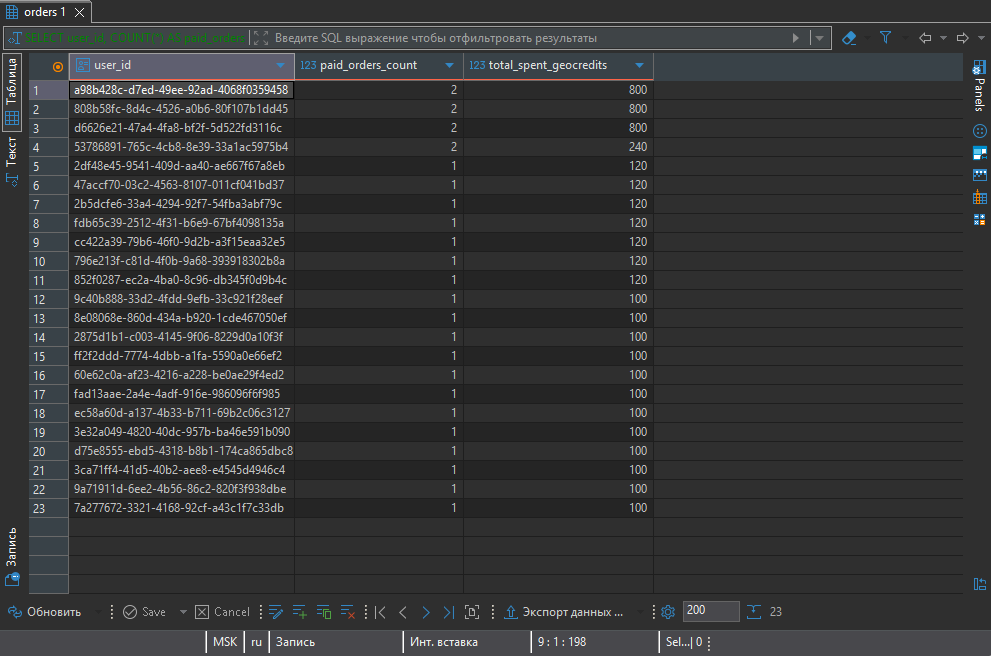
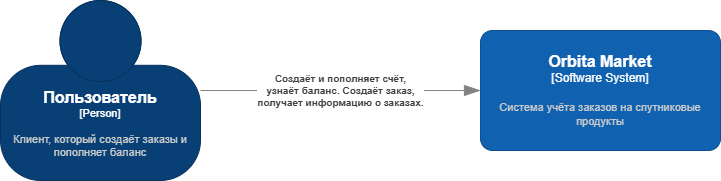
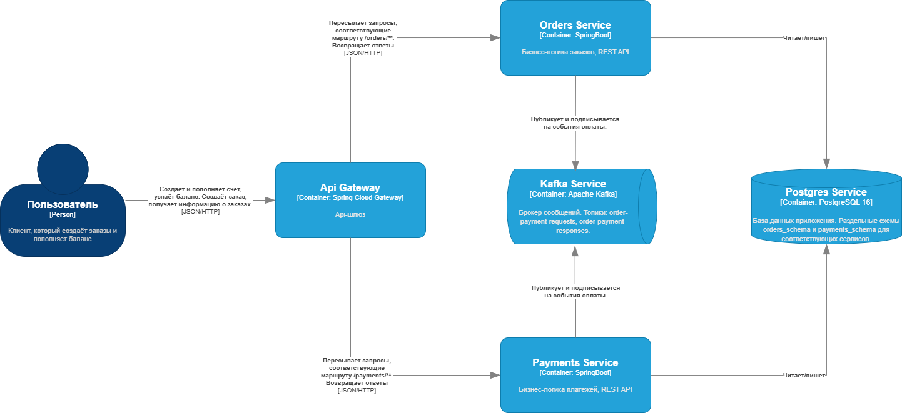
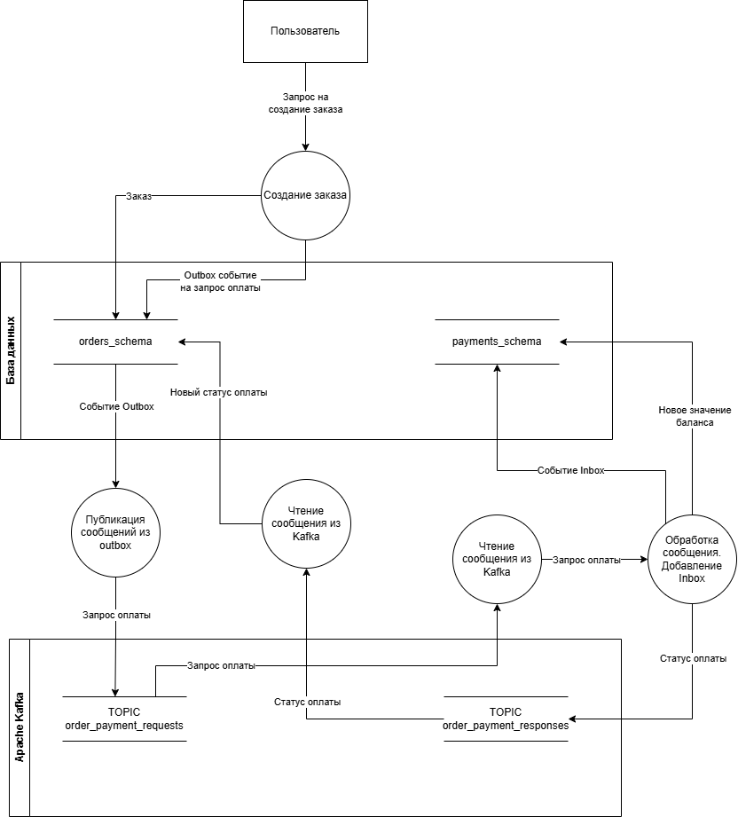

# Oribta Market

## Запуск и эксплуатация
### Запуск проекта
* Перейти в корень проекта тестируемого приложения
* Создать файл .env и определить в нём переменные окружения
  по примеру из файла .env.example
* выполнить команду ```docker compose up --build```

### Идентификация пользователя
В запросах указывается заголовок X-User-Id содержащий UUID пользователя.

Пример user_id: ec4ca25a-389e-4f8e-9032-e800f559955d

### Конфигурация Kafka
Имена топиков:
 * order-payment-requests
 * order-payment-responses

### Статистика
Результат выполнения analytics.sql на тестовых данных



## Планирование
Этап планирования описан в [docs/PROJECT.md](docs/PROJECT.md)

## Разработка
### Диаграммы C4
1. Диаграмма контеста



2. Диаграмма контейнера



### Диаграмма потока оплаты



## Тестирование
Приложение автотестов и сведения о тестирования расположены
в отдельном репозитории
<https://github.com/Chromiumore/IndDevOrbitaMarketAutotests>

## Анализ безопасности
Результаты сканирования и таблица триажа описаны в [docs/security.pdf](docs/security.pdf)